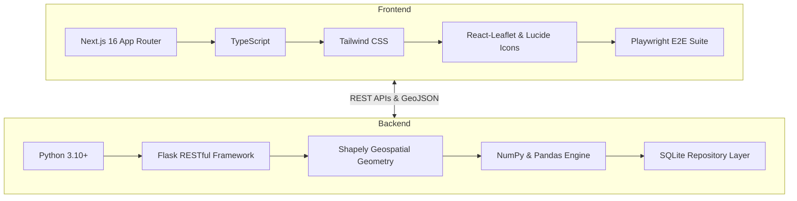

# 🌍 Relocate AI

<div align="center">

[](https://sih.gov.in)
[](https://nextjs.org)
[](https://flask.palletsprojects.com)
[-10B981?style=for-the-badge&logo=pytest&logoColor=white)](backend/tests)
[](#-scientific-methodology)

**Next-Generation AI-Powered Geospatial Decision Support System for Disaster-Induced Habitation Relocation & Carrying Capacity Optimization**

[Explore Features](#-core-platform-modules) • [System Architecture](#-system-architecture) • [Quickstart Guide](#-quickstart--installation) • [API Reference](#-api-reference) • [Methodology](#-scientific-methodology)

</div>

---

## 📌 Executive Summary

Natural disasters such as catastrophic flooding, landslides, and riverbank erosion displace vulnerable communities across India every year. Traditional post-disaster rehabilitation often suffers from fragmented data, arbitrary site allocations, infrastructure bottlenecks, and lack of real-time auditability.

**Relocate AI** is an enterprise-grade Decision Support System (DSS) developed for **Smart India Hackathon 2026 (Problem Statement: SIH26191)**. It provides disaster management authorities (NDMA/SDMA) with an end-to-end scientific pipeline:

```
┌─────────────────┐     ┌──────────────────┐     ┌──────────────────┐     ┌──────────────────┐
│ REAL DATA INGEST│ ──> │ IPCC RISK ENGINE │ ──> │ SAFE SITE RANKING│ ──> │ MULTI-CAPACITY   │
│ CSV / GeoJSON   │     │ H + E + V = RPI  │     │ Slope/Hazard/Road│     │ OPTIMIZER        │
└─────────────────┘     └──────────────────┘     └──────────────────┘     └──────────────────┘
                                                                                    │
┌─────────────────┐     ┌──────────────────┐     ┌──────────────────┐              ▼
│ POST-MONITORING │ <── │ FIELD AUDIT &    │ <── │ AUTOMATED ALERTS │ <── ┌──────────────────┐
│ Livelihood/Infra│     │ RECALCULATION    │     │ P1/P2 Escalation │     │ ACTION PLAN      │
└─────────────────┘     └──────────────────┘     └──────────────────┘     │ Executive Orders │
                                                                          └──────────────────┘
```

---

## 🌟 Key Capabilities & Highlights

- 🧠 **Dynamic Multi-Engine Pipeline**: Implements the international IPCC risk formula: $\text{Risk} = f(\text{Hazard}, \text{Exposure}, \text{Vulnerability})$ with 100% dynamic calculations (zero static/mock fallbacks).
- 📍 **Sub-Meter Geospatial Intelligence**: Full polygon intersection (Shapely), terrain slope analysis, digital elevation modeling, and dual-layer interactive mapping (Leaflet + Satellite tiles).
- 📊 **8-Dimensional Carrying Capacity Ledger**: Evaluates prospective safe sites against Land, Housing, Water, Sanitation, Healthcare, Education, Road, and Electricity capacity limits converted into human-supported units.
- ⚡ **Priority-Greedy Multi-Habitation Optimizer**: Optimizes multi-habitation relocation allocations based on urgency, safe site suitability, distance decay, and live capacity constraints.
- 📝 **Live Field Verification & Recalculation**: Two-way synchronization between ground-truth survey reports and backend engines. When field data updates, vulnerability and RPI automatically recalculate across the entire platform.
- 🌧️ **Live Scenario Simulation Engine**: Allows emergency commanders to simulate rainfall spikes (e.g., $+50\%$, $+100\%$) and inspect cascading impacts on hazard zones, RPI scores, and optimizer allocations in real-time.
- 🚨 **Automated Alert & Notification System**: Event-driven notification engine categorizing triggers (Hazard Escalation, Overcrowding, Field Discrepancies) with severity badges (Critical, High, Medium) and action routes.

---

## 🏛️ System Architecture

```
                                  RELOCATE AI ARCHITECTURE
                                  
 ┌────────────────────────────────────────────────────────────────────────────────────────┐
 │                              PRESENTATION LAYER (Next.js 16)                           │
 │                                                                                        │
 │  ┌───────────────┐ ┌───────────────┐ ┌───────────────┐ ┌───────────────┐ ┌──────────┐  │
 │  │   Executive   │ │  Geospatial   │ │  Safe Site &  │ │  Relocation   │ │  Action  │  │
 │  │   Dashboard   │ │   Risk Map    │ │   Capacity    │ │   Optimizer   │ │   Plan   │  │
 │  └───────┬───────┘ └───────┬───────┘ └───────┬───────┘ └───────┬───────┘ └────┬─────┘  │
 │          │                 │                 │                 │              │        │
 │  ┌───────┴───────┐ ┌───────┴───────┐ ┌───────┴───────┐ ┌───────┴───────┐ ┌────┴─────┐  │
 │  │   Data Ingest │ │     Field     │ │   Scenario    │ │   Alerts &    │ │    ML    │  │
 │  │    Wizard     │ │ Verification  │ │  Simulation   │ │ Notifications │ │  Explain │  │
 │  └───────┬───────┘ └───────┬───────┘ └───────┬───────┘ └───────┬───────┘ └────┬─────┘  │
 └──────────┼─────────────────┼─────────────────┼─────────────────┼──────────────┼────────┘
            │                 │  REST API / JSON │                 │              │
 ┌──────────┼─────────────────┼─────────────────┼─────────────────┼──────────────┼────────┐
 │          ▼                 ▼                 ▼                 ▼              ▼        │
 │                              APPLICATION ENGINE LAYER (Flask)                          │
 │                                                                                        │
 │  ┌──────────────────────────────────────────────────────────────────────────────────┐  │
 │  │                             MASTER ORCHESTRATOR ENGINE                           │  │
 │  │  ┌─────────────────┐ ┌───────────────────┐ ┌───────────────────┐ ┌────────────┐  │  │
 │  │  │  Hazard Engine  │ │  Exposure Engine  │ │ Vulnerability Eng │ │ RPI Engine │  │  │
 │  │  │ (Point-in-Poly) │ │  (Slope/Elev/Dist)│ │ (Demog/Socio-Ecn) │ │ (Weighted) │  │  │
 │  │  └─────────────────┘ └───────────────────┘ └───────────────────┘ └────────────┘  │  │
 │  └──────────────────────────────────────────────────────────────────────────────────┘  │
 │                                                                                        │
 │  ┌───────────────────┐ ┌───────────────────┐ ┌───────────────────┐ ┌────────────────┐  │
 │  │ Safe Site Engine  │ │ Carrying Capacity │ │ Relocation Greedy │ │ Alert Engine & │  │
 │  │ Suitability Score │ │ Bottleneck Ledger │ │ Optimal Assignee  │ │ Escalations    │  │
 │  └───────────────────┘ └───────────────────┘ └───────────────────┘ └────────────────┘  │
 │                                                                                        │
 │  ┌───────────────────┐ ┌───────────────────┐ ┌───────────────────┐ ┌────────────────┐  │
 │  │  Data Ingestion   │ │   Recalculation   │ │ Scenario Climate  │ │ ML Evaluation  │  │
 │  │ Cleaner/Validator │ │ Cascading Service │ │ Simulation Engine │ │ Feature SHAP   │  │
 │  └───────────────────┘ └───────────────────┘ └───────────────────┘ └────────────────┘  │
 └────────────────────────────────────────┬───────────────────────────────────────────────┘
                                          │
 ┌────────────────────────────────────────▼───────────────────────────────────────────────┐
 │                               PERSISTENCE & DATA LAYER                                 │
 │                                                                                        │
 │  ┌─────────────────────┐   ┌────────────────────────┐   ┌───────────────────────────┐  │
 │  │ SQLite Data Store   │   │ GeoJSON / Spatial GIS  │   │ Audit Trail & Survey Logs │  │
 │  │ Relational Entities │   │ Digitized Hazard Polys │   │ Two-way Field History     │  │
 │  └─────────────────────┘   └────────────────────────┘   └───────────────────────────┘  │
 └────────────────────────────────────────────────────────────────────────────────────────┘
```

---

## 📦 Core Platform Modules

The application delivers 13 dedicated, fully interactive modules:

| # | Module | Route | Purpose & Key Functionality |
|---|--------|-------|------------------------------|
| **1** | **Executive Dashboard** | `/` or `/dashboard` | High-level KPI cards, Red-Zone summaries, RPI score breakdown, priority distribution, and immediate alerts. |
| **2** | **Geospatial Risk Map** | `/risk-map` | High-performance Leaflet canvas with Satellite/OSM toggles, flood polygon overlays, buffer rings, and habitation popups. |
| **3** | **Data Management Wizard** | `/data-management` | Production-ready CSV and GeoJSON ingestion with automated schema inspection, column mapping, coordinate standardization, and validation. |
| **4** | **Calculation Engines** | `/engines` | Granular unit-testing console for Hazard, Exposure, Vulnerability, and Master RPI engines with live payload execution. |
| **5** | **Relocation Necessity** | `/necessity` | In-depth multi-criteria evaluation classifying habitations into Critical, High, Moderate, and Low urgency categories. |
| **6** | **Safe Site Suitability** | `/safe-sites` | Multi-factor analysis assessing potential destination sites on terrain safety, road connectivity, hospital proximity, and exclusions. |
| **7** | **Carrying Capacity** | `/capacity` | 8-dimensional infrastructure bottleneck analyzer calculating sustainable population headroom per safe site. |
| **8** | **Relocation Optimizer** | `/optimizer` | Dynamic priority-greedy allocation assigning affected populations to optimal safe sites while respecting live capacity caps. |
| **9** | **Government Action Plan** | `/action-plan` | Official directive generator detailing phased relocation timelines, budget breakdowns, logistics routes, and downloadable PDF/CSV reports. |
| **10** | **Field Verification** | `/field-verification` | Interactive verification portal for ground officers with conflict resolution and automated engine recalculation trigger. |
| **11** | **Climate Simulation** | `/simulation` | Sandbox environment for stress-testing disaster models under variable rainfall scenarios (e.g., $120 \to 240\text{ mm/day}$). |
| **12** | **Alert & Escalation** | `/notifications` | Operational notification hub for real-time risk spikes, capacity breaches, and field conflict alerts with acknowledgment tracking. |
| **13** | **ML Evaluation** | `/ml-evaluation` | Model explainability dashboard showing feature importance, weight calibration, residual error distributions, and validation metrics. |

---

## 🛠️ Technology Stack



---

## 🔬 Scientific Methodology

### 1. IPCC Disaster Risk Formula

The Relocation Priority Index (RPI) is calculated in accordance with the **IPCC AR5/AR6 Risk Assessment Framework**:

$$\text{RPI} = (w_h \times \text{Hazard Score}) + (w_e \times \text{Exposure Score}) + (w_v \times \text{Vulnerability Score})$$

*Default Configured Weights: $w_h = 0.40$, $w_e = 0.30$, $w_v = 0.30$*

```
├── Hazard Engine (40%): Spatial point-in-polygon intersection with digitized flood/landslide risk zones
├── Exposure Engine (30%): Elevation vulnerability (< 100m) + Slope steepness (> 25°) + River proximity
└── Vulnerability Engine (30%): Population density + Household overcrowding (> 7/HH) + Healthcare deficiency
```

### 2. Priority-Greedy Relocation Optimization Algorithm

```
Step 1: Filter Affected Habitations (RPI >= Threshold or In Inundation Zone)
Step 2: Sort Habitations descending by Relocation Urgency Score
Step 3: For each Habitation:
          a. Identify all Safe Candidate Sites
          b. Filter out Disqualified Sites (Unsafe terrain / Inundated)
          c. Compute Suitability Ranking = f(Distance Decay, Infrastructure, Road Access)
          d. Check Remaining Carrying Capacity: min(Housing, Water, Health, Sanitation, ...)
          e. Assign min(Habitation Population, Available Site Capacity)
          f. Deduct assigned population from site's multi-dimensional capacity ledger
          g. If unassigned population remains, spillover to next optimal candidate site
Step 4: Generate Execution Ledger, Distance Traveled, and Action Directives
```

---

## 🚀 Quickstart & Installation

### Prerequisites

Ensure you have the following installed on your machine:
- **Node.js** (v18.0 or higher)
- **Python** (v3.10 or higher)
- **Git**

### 1. Clone the Repository

```bash
git clone https://github.com/dsy404/SIH-2026.git
cd SIH-2026
```

### 2. Backend Setup

```bash
cd backend

# Create and activate virtual environment
# On Windows (PowerShell):
python -m venv venv
.\venv\Scripts\Activate.ps1

# On Linux/macOS:
python3 -m venv venv
source venv/bin/activate

# Install dependencies
pip install -r requirements.txt

# Start backend server
python run.py
```
> 🌐 Backend will be running at **`http://localhost:8000`**

### 3. Frontend Setup

Open a new terminal tab:

```bash
cd frontend

# Install Node dependencies
npm install

# Start Next.js development server
npm run dev
```
> 🌐 Frontend will be accessible at **`http://localhost:3000`**

---

## 📡 API Reference & Endpoints

| Category | Method | Endpoint | Description |
|----------|--------|----------|-------------|
| **Health** | `GET` | `/api/health` | Service health status & engine readiness |
| **Dashboard** | `GET` | `/api/dashboard/stats` | Aggregated district metrics, red zones, and RPI counts |
| **Habitations** | `GET` | `/api/habitations` | Returns all 25 geo-referenced habitations with scores |
| **Candidate Sites** | `GET` | `/api/sites` | Retrieves all safe destination sites with capacity data |
| **Hazard Spatial** | `GET` | `/api/hazards` | Returns digitized GeoJSON flood/landslide hazard zones |
| **Engines** | `POST` | `/api/engines/hazard` | Standalone point-in-polygon hazard calculation |
| **Engines** | `POST` | `/api/engines/exposure` | Calculates slope & elevation physical exposure |
| **Engines** | `POST` | `/api/engines/vulnerability` | Calculates socio-demographic vulnerability |
| **Engines** | `POST` | `/api/engines/master` | Executes full weighted RPI assessment pipeline |
| **Optimizer** | `POST` | `/api/optimizer/run` | Runs priority-greedy multi-site allocation |
| **Capacity** | `GET` | `/api/capacity/breakdown` | 8-factor carrying capacity breakdown per site |
| **Field Survey** | `POST` | `/api/field-verification/submit` | Submits field verification & triggers recalculation |
| **Simulation** | `POST` | `/api/simulation/run` | Executes rainfall scenario stress-test |
| **Alerts** | `GET` | `/api/alerts` | Fetches active system alerts with severity levels |
| **Data Ingest** | `POST` | `/api/datasets/upload` | Validates and ingests CSV / GeoJSON datasets |

---

## 🧪 Testing & Verification

The codebase includes an exhaustive test suite covering unit, integration, and E2E validation:

```bash
# Run backend pytest suite (57 tests)
cd backend
python -m pytest tests/ -v
```

```
========================= 57 passed in 1.42s =========================
backend/tests/test_alert_engine.py ..........                     [17%]
backend/tests/test_data_consistency.py .....                      [26%]
backend/tests/test_e2e_pipeline.py ...........                    [45%]
backend/tests/test_field_verification.py .....                    [54%]
backend/tests/test_phase4_consistency.py .....                    [63%]
backend/tests/test_real_data_ingestion.py .......                 [75%]
backend/tests/test_relocation_optimizer.py ........               [89%]
backend/tests/test_safe_site_capacity.py ......                   [100%]
```

```bash
# Run frontend Playwright E2E tests
cd frontend
npx playwright test
```

---

## 🗺️ Project Structure

```
SIH-2026/
├── backend/                         # Flask Backend Application
│   ├── app/
│   │   ├── api/routes/              # 12 Modular API Blueprints
│   │   │   ├── alerts.py            # Alert & Notification Routes
│   │   │   ├── capacity.py          # Carrying Capacity Routes
│   │   │   ├── dashboard.py         # Summary Analytics Routes
│   │   │   ├── datasets.py          # Data Ingestion Routes
│   │   │   ├── field_verification.py# Ground-Truth Audit Routes
│   │   │   ├── habitations.py       # Habitation Feature Routes
│   │   │   ├── optimizer.py         # Greedy Optimization Routes
│   │   │   ├── safe_sites.py        # Site Suitability Routes
│   │   │   └── simulation.py        # Climate Scenario Routes
│   │   ├── data_ingestion/          # Ingestion Parsers & Validators
│   │   ├── db/                      # Repository Layer & Seed Data
│   │   ├── engines/                 # Mathematical Core Engines
│   │   │   ├── alert_engine.py      # Automated Escalation Engine
│   │   │   ├── hazard_engine.py     # Polygon Intersection Analysis
│   │   │   ├── exposure_engine.py   # Elevation/Slope Exposure
│   │   │   ├── vulnerability_engine.py# Socio-Economic Vulnerability
│   │   │   ├── master_engine.py     # Weighted Aggregator
│   │   │   ├── recalculation_service.py # Cascading Field Recalculator
│   │   │   └── relocation/          # Optimizer & Carrying Capacity
│   │   └── geospatial/              # CRS, Distance & Spatial Utilities
│   ├── data/                        # Synthetic Data & CSV Templates
│   ├── tests/                       # 57 Pytest Integration Tests
│   ├── requirements.txt             # Backend Python Dependencies
│   └── run.py                       # Backend Server Entrypoint
│
├── frontend/                        # Next.js 16 React Web Application
│   ├── src/
│   │   ├── app/                     # 13 Dedicated App Router Pages
│   │   │   ├── action-plan/         # Government Action Directive View
│   │   │   ├── capacity/            # Carrying Capacity Ledger View
│   │   │   ├── dashboard/           # Executive KPI Analytics View
│   │   │   ├── data-management/     # Data Ingestion Wizard View
│   │   │   ├── engines/             # Calculation Engine Sandbox View
│   │   │   ├── field-verification/  # Field Survey Audit View
│   │   │   ├── ml-evaluation/       # ML Explainability View
│   │   │   ├── necessity/           # Relocation Urgency View
│   │   │   ├── notifications/       # Alert & Escalation Dispatch View
│   │   │   ├── optimizer/           # Relocation Optimizer View
│   │   │   ├── post-relocation/     # Post-Disaster Monitoring View
│   │   │   ├── risk-map/            # Geospatial Leaflet Canvas View
│   │   │   └── simulation/          # Scenario Simulation Sandbox View
│   │   ├── components/              # Reusable Modular UI Components
│   │   └── config/app.ts            # Global App Constants & Config
│   ├── e2e/                         # Playwright E2E Test Suite
│   └── package.json                 # Frontend Node Dependencies
│
└── README.md                        # Documentation & Project Guide
```

---

## 👥 Contributors 

Developed with pride for **Smart India Hackathon (SIH) 2026** by team **LOLGORITHMS**.

<div align="center">

*Empowering humanitarian and disaster management authorities with data-driven, equitable, and transparent relocation intelligence.*

</div>
